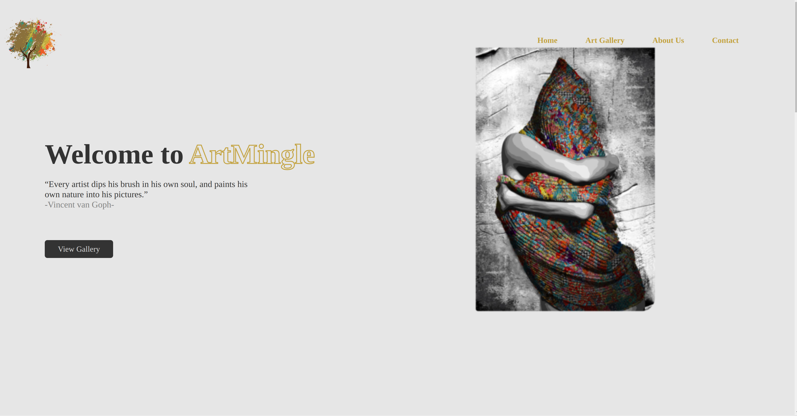
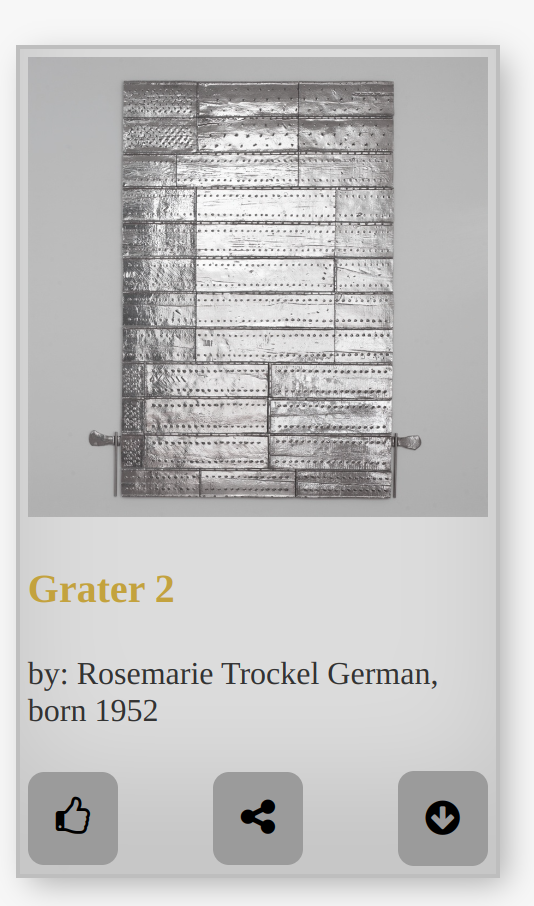
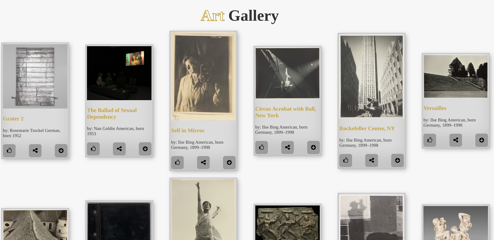

# [ArtMingle](https://owallah.github.io/Phase-1-Project/)
This Web application is a single page web that utilizes the power of HTML, Javascript and Css.
The application fetches the data from [Art Institute of Chicago](https://api.artic.edu/api/v1/artworks/) API.

## Table of Contents
1. [ArtMingle](#artmingle)
2. [Functions](#functions)
    - [Usage](#usage)
    - [Images](#images)
    - [Installation](#installation)
3. [License](#license)

ArtMingle fetches the Art Items including:
- Image Url
- The Image Title
- The Artists
- etc...

With this information I display the art items as an art gallery would.
The user can:
    -Like an item
    -Search through the list
    -Download an Image

### Functions
This project incorporates several functions each of which performs a different functionality.
These include: 
- `fetchArtItems()`
This function fetches items from the Api. It fetches items on page 2 of the Api and returns 50 items.
It then converts the response given to `json()` and then passes the data to the next function.

- `renderArtItems()`
THis function takes the data given in the previous function as an argument and renders the data to be viewed by the user.

- `searchArtItem()`
THis function takes a search value input from the search input and attempts to search the value through the Api.
It then returns ID's of the data and passes it to the next function to fetch.

- `fetchSearchedItems()`
This function takes the ID'S from the previous function and attemts to fetch the data.
It then converts the response to `json()` and passes the data to the next function to render it.

- `renderSearchedArtItems()`
Last but certainly not list, this function takes the data from the preceeding function and renders it so the user can be able to see searched items on their screen.

## Usage
On the home page, you will see a list of art items fetched from the API. You can like an art item by clicking the "like" button. You can also download the image of an art item by clicking the "download" button.

To search for a specific art item, type your search query in the search bar and click the "search" button. The search results will be displayed below the search bar.

## Images
Header Section

Art Item

Gallery Section

## Installation
Clone the repository to your local machine.
    - run `git clone` followed by the [github link](https://github.com/Owallah/Phase-1-Project.git).
Open the `index.html` file in your browser.

### License
This project is licensed under the `MIT License`.

Authored by:
>[Michael Johnson](https://github.com/Owallah)

